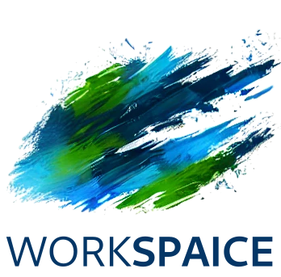

## Human + AI, creating together.

Workspaice is a locally-run application that revolutionizes the way you work on projects. By seamlessly blending human creativity with AI assistance, Workspaice empowers you to create, innovate, and bring your ideas to fruition like never before.

Official website: https://workspaicehq.com

## 🌟 Key Features

- **Local-First**: Run Workspaice directly on your computer, ensuring privacy and speed.
- **AI Collaboration**: Work side-by-side with AI to enhance your productivity and creativity.
- **Project Management**: Easily create and organize your projects in one place.
- **Cross-Platform**: Built with Laravel and SQLite for a smooth experience across different operating systems.

## 🚀 Getting Started

1. **Clone the Repository**
   ```
   git clone https://github.com/nunodonato/workspaice.git
   cd workspaice
   ```

2. **Install Dependencies**
   ```
   composer install
   npm install
   ```

3. **Set Up Environment**
   ```
   cp .env.example .env
   php artisan key:generate
   ```

4. **Configure .env File**
   Open the `.env` file and update the following:
    - Ensure the database connection is set to SQLite:
      ```
      DB_CONNECTION=sqlite
      ```
    - Add your Anthropic API key:
      ```
      ANTHROPIC_API_KEY=your_api_key_here
      ```

5. **Set Up the Database**
   ```
   touch database/database.sqlite
   php artisan migrate:fresh
   ```

6. **Build Assets**
   ```
   npm run build
   ```

7. **Start the Application**
   You'll need to run two commands in parallel:

   In one terminal, start the server:
   ```
   php artisan serve
   ```

   In another terminal, start the queue worker:
   ```
   php artisan queue:work
   ```

   Visit `http://localhost:8000` in your browser to start using Workspaice!
